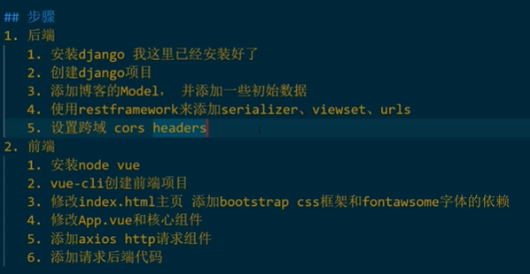

# DEMO 1 for COMP3900

## Target for Sprint1  

- Select labels from catalogue (Frontend/Backend)

- Enter ingredients by typing (Frontend/Backend/Backend Interface)

- Label suggestion (Frontend/Backend)

- Review labels (Frontend)

- Search recipe (Frontend/Backend/Backend Interface)

## Backend

    Backend                     <----- Root  
        ├── Apps                <----- Apps  
        │   ├── recipes         <----- Recipes (CRUD recipes, search recipes, etc.)  
        │   └── users           <----- Users (login, logout, user data)  
        └── MealMatchServer     <----- Main Server  

## Django

### Project

### App

- **models.py**: manipulations about databases

## References

- [django&vue前后端分离CRUD案例](https://www.bilibili.com/video/BV1Lt4y117ji?from=search&seid=11841823850391446148)

    
